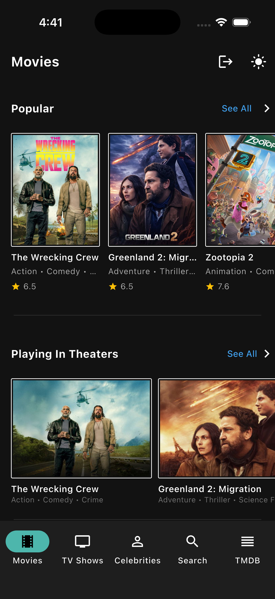

# 🎬 TMDB Flutter App

A modern Flutter application that integrates with The Movie Database (TMDB) API to provide users with comprehensive movie and TV show information.

[](https://flutter.dev)
[](https://dart.dev)
[](https://www.themoviedb.org/)

## 📱 About

This Flutter application leverages The Movie Database (TMDB) API to deliver a seamless experience for discovering movies, TV shows, and entertainment content. Built with clean architecture principles and modern state management.

## ✨ Features

- 🔐 **User Authentication** - Secure TMDB account login with session management
- 🎥 **Browse Content** - Explore movies and TV shows
- 🔍 **Search Functionality** - Find your favorite content quickly
- 📊 **Detailed Information** - View comprehensive details about movies and shows
- ⭐ **Ratings & Reviews** - Check ratings and user reviews
- 📑 **Watchlist** - Manage your personal watchlist
- ❤️ **Favorites** - Save your favorite content
- 🔥 **Trending** - Discover what's trending
- 💾 **Offline Support** - Session persistence across app restarts

## 🛠️ Tech Stack

### Core Framework
- **Flutter** - Cross-platform mobile development
- **Dart** - Programming language

### State Management
- **flutter_bloc** - BLoC pattern implementation
- **Cubit** - Simplified state management for authentication

### Architecture
- **Clean Architecture** with three layers:
    - **Presentation Layer** - UI and BLoC/Cubit
    - **Domain Layer** - Business logic and entities
    - **Data Layer** - API client and repositories

### Key Dependencies
```yaml
dependencies:
  flutter:
    sdk: flutter
  
  # State Management
  flutter_bloc: ^8.1.3
  equatable: ^2.0.5
  
  # Networking
  http: ^1.1.0
  dio: ^5.4.0
  
  # Local Storage
  shared_preferences: ^2.2.2
  flutter_secure_storage: ^9.0.0
  
  # JSON Handling
  json_annotation: ^4.8.1
  
  # Dependency Injection
  get_it: ^7.6.4

dev_dependencies:
  build_runner: ^2.4.6
  json_serializable: ^6.7.1
  flutter_lints: ^3.0.0
```

## 📁 Project Structure
```
lib/
├── core/
│   ├── constants/
│   ├── utils/
│   └── errors/
├── data/
│   ├── api_client/
│   │   └── api_client.dart          # TMDB API wrapper
│   ├── models/                       # Data models (DTOs)
│   ├── repositories/                 # Repository implementations
│   └── datasources/                  # Remote & local data sources
├── domain/
│   ├── entities/                     # Business entities
│   ├── repositories/                 # Repository interfaces
│   └── usecases/                     # Business logic use cases
├── presentation/
│   ├── cubits/
│   │   └── auth/
│   │       ├── auth_cubit.dart      # Authentication state management
│   │       └── auth_state.dart      # Authentication states
│   ├── screens/                      # UI screens
│   ├── widgets/                      # Reusable widgets
│   └── theme/                        # App theming
└── main.dart                         # App entry point
```

## 🔐 Authentication Flow

The app implements TMDB's standard authentication flow:

1. **Create Request Token** - Generate a temporary request token
2. **Validate with Login** - Validate user credentials with the token
3. **Create Session** - Convert validated token to a session ID
4. **Persist Session** - Store session for future app launches
5. **Auto-Login** - Check authentication status on app restart

### Authentication States
```dart
- AuthInitial        // Initial state
- AuthLoading        // Processing authentication
- AuthAuthenticated  // User logged in successfully
- AuthUnauthenticated // User not logged in
- AuthError          // Authentication error occurred
```

## 🚀 Getting Started

### Prerequisites

- Flutter SDK (>=3.0.0) - [Install Flutter](https://flutter.dev/docs/get-started/install)
- Dart SDK (>=3.0.0)
- A code editor (VS Code, Android Studio, or IntelliJ IDEA)
- TMDB API Key - [Get your API key](https://www.themoviedb.org/settings/api)

### Installation

1. **Clone the repository**
```bash
   git clone https://github.com/tafwez/tmdb-flutter-app.git
   cd tmdb-flutter-app
```

2. **Install dependencies**
```bash
   flutter pub get
```

3. **Configure API Key**

   Create a file `lib/core/constants/api_constants.dart`:
```dart
   class ApiConstants {
     static const String apiKey = 'YOUR_TMDB_API_KEY';
     static const String baseUrl = 'https://api.themoviedb.org/3';
     static const String imageBaseUrl = 'https://image.tmdb.org/t/p/';
   }
```

4. **Run the app**
```bash
   # For development
   flutter run
   
   # For release build
   flutter build apk  # Android
   flutter build ios  # iOS
```

## 🔑 TMDB API Integration

### Endpoints Used

- `POST /authentication/token/new` - Create request token
- `POST /authentication/token/validate_with_login` - Validate credentials
- `POST /authentication/session/new` - Create session
- `DELETE /authentication/session` - Delete session
- `GET /account` - Get account details
- `GET /movie/popular` - Get popular movies
- `GET /tv/popular` - Get popular TV shows
- `GET /search/movie` - Search movies
- `GET /search/tv` - Search TV shows

### API Authentication

All API requests require authentication:
```dart
headers: {
  'Authorization': 'Bearer YOUR_API_KEY',
  'Content-Type': 'application/json',
}
```

## 📸 Screenshots

| Home Screen | Movie Details | Search |
|------------|---------------|---------|
|  |  |  |


## 🧪 Testing
```bash
# Run all tests
flutter test

# Run with coverage
flutter test --coverage

# View coverage report
genhtml coverage/lcov.info -o coverage/html
open coverage/html/index.html
```

## 🏗️ Build
```bash
# Android APK
flutter build apk --release

# Android App Bundle
flutter build appbundle --release

# iOS
flutter build ios --release
```

## 🤝 Contributing

Contributions are welcome! Please feel free to submit a Pull Request.

1. Fork the project
2. Create your feature branch (`git checkout -b feature/AmazingFeature`)
3. Commit your changes (`git commit -m 'Add some AmazingFeature'`)
4. Push to the branch (`git push origin feature/AmazingFeature`)
5. Open a Pull Request

## 📝 License

This project is licensed under the MIT License - see the [LICENSE](LICENSE) file for details.

## 👨‍💻 Author

**Your Name** Tafwiz hassan
- GitHub: [@tafwez](https://github.com/yourusername)
- LinkedIn: [@tafwiz](https://www.linkedin.com/in/tafwiz-hassan-808859142/)
- Email: hassantafwez@gmail.com

## 🙏 Acknowledgments

- [The Movie Database (TMDB)](https://www.themoviedb.org/) for providing the comprehensive API
- [Flutter](https://flutter.dev/) team for the amazing framework
- [flutter_bloc](https://bloclibrary.dev/) for excellent state management

## 📄 Additional Resources

- [TMDB API Documentation](https://developers.themoviedb.org/3)
- [Flutter Documentation](https://docs.flutter.dev/)
- [BLoC Pattern Guide](https://bloclibrary.dev/#/coreconcepts)
- [Clean Architecture in Flutter](https://resocoder.com/flutter-clean-architecture-tdd/)

---

**⭐ If you find this project useful, please consider giving it a star!**

## 📊 Project Status

🚧 **Status:** Active Development

- [x] Authentication system
- [x] Session management
- [ ] Movie browsing
- [ ] TV show browsing
- [ ] Search functionality
- [ ] Watchlist feature
- [ ] Favorites feature
- [ ] User reviews
- [ ] Offline caching

## 🗺️ Roadmap

- [ ] Add dark mode support
- [ ] Implement caching strategy
- [ ] Add unit tests coverage
- [ ] Add widget tests
- [ ] Internationalization (i18n)
- [ ] Add trailer playback
- [ ] Implement recommendations
- [ ] Social sharing features

---

Made with ❤️ using Flutter